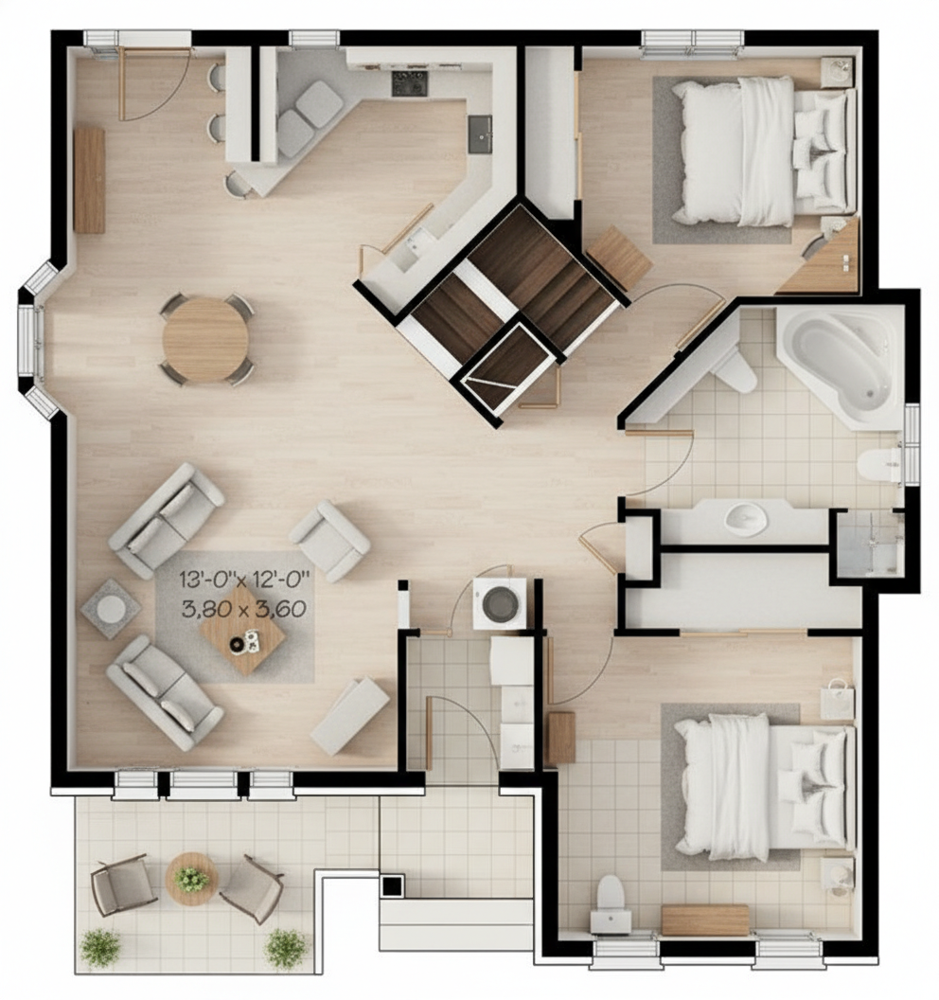

# Roomie

Roomie is an AI-assisted architecture workspace that turns uploaded 2D floor plans into photorealistic, top-down 3D visualizations.



## What Roomie does

1. Sign in with a Puter account.
2. Upload a JPG or PNG floor plan by selecting a file or dragging it onto the upload area.
3. Roomie validates the image and publishes the source plan to a dedicated Puter-hosted project path.
4. The visualizer sends the hosted plan to Puter AI for a photorealistic, orthographic top-down render.
5. Compare the generated image with the original plan, retry if needed, and download the result.

The generation prompt treats the uploaded plan as an immutable blueprint. It prioritizes the original canvas, footprint, partitions, openings, fixtures, furniture positions, and room semantics while removing labels, dimensions, and drafting marks from the rendered output.

## Current features

- JPG and PNG validation, including file signatures, decoded dimensions, and a 10 MB upload limit
- Click-to-upload and drag-and-drop workflows with progress, cancellation, and accessible status feedback
- Puter authentication and owner-bound project sessions
- Transactional Puter filesystem publishing with staged writes, collision protection, and recovery handling
- Public hosted source-image URLs scoped to a private, owner-bound project list
- Puter Gemini image-to-image generation using the source image's aspect ratio
- Strict orthographic, topology-preserving render instructions
- Processing, success, error, retry, comparison, and download states
- Cross-tab account coordination and duplicate automatic-generation protection
- Responsive layout and reduced-motion support

## Technology

- React 19
- React Router 8
- TypeScript 5
- Vite 8
- Tailwind CSS 4
- Puter.js 2.6 for authentication, filesystem hosting, key-value configuration, and AI generation
- Lucide React icons

## Local development

### Requirements

- Node.js 22.6 or newer
- npm
- A Puter account for live upload and AI-generation flows
- A browser with Web Locks and local storage support for reliable cross-tab account coordination

No API key or local environment file is required. Puter prompts the user to authenticate and associates cloud usage with that Puter account.

### Install and run

```bash
git clone https://github.com/AhmTb/Roomie.git
cd Roomie
npm ci
npm run dev
```

Open [http://localhost:5173](http://localhost:5173).

## Available commands

```bash
npm run dev        # Start the development server with HMR
npm test           # Run compatibility and generation-contract tests
npm run typecheck  # Generate route types and run TypeScript checks
npm run build      # Create the production client and server bundles
npm run start      # Serve an existing production build
```

Before submitting a change, run:

```bash
npm test
npm run typecheck
npm run build
```

## Docker

Build and run the production image:

```bash
docker build -t roomie .
docker run --rm -p 3000:3000 roomie
```

Then open [http://localhost:3000](http://localhost:3000).

## Data and privacy model

- Uploaded source plans are stored in the signed-in user's Puter filesystem.
- Each source plan receives a public Puter-hosted URL. Anyone who obtains that URL can access the image.
- Project discovery in Roomie is private to the current Puter owner and browser session.
- Generated renders are transient: Roomie keeps a small in-memory cache and does not upload or persist the generated image during the visualization step.
- Download generated work before refreshing or closing the page.

Do not upload confidential plans unless public-link access is acceptable.

## Limitations

- AI image generation is probabilistic. The prompt strongly prioritizes the supplied topology, but a single generative image-edit call cannot guarantee CAD-level geometric accuracy.
- Roomie currently accepts raster JPG and PNG plans; PDF, DWG, DXF, and BIM ingestion are not implemented.
- Project metadata and generated renders are not durably synchronized across browsers or devices.
- Live AI generation may consume the signed-in user's Puter resources. Retrying can start another request.
- The project is under active development and is not a substitute for construction drawings, code review, or professional architectural validation.

## Project structure

```text
app/          React Router routes, document shell, and styles
components/   Navigation, upload UI, and shared controls
lib/          Puter auth/hosting, upload validation, and AI-generation logic
public/       Static project imagery and favicon
tests/        Node compatibility and generation-contract tests
```

## License

No open-source license has been added yet. All rights are reserved by the repository owner.
